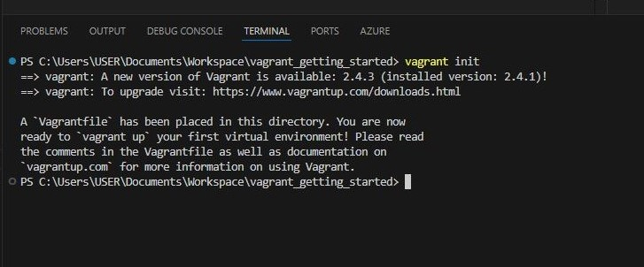

### Installation
1. Install Vagrant
    - To start using Vagrant, you first need to install it on your machine.
    - Visit the Vagrant Downloads Page:

    - Click on the following link to access the official Vagrant download page: Vagrant Downloads.

    - Choose the appropriate version for your operating system (Windows, macOS, or Linux) and follow the installation instructions provided.

2. Verify the Installation
    - After installation, it’s important to confirm that Vagrant was installed correctly.
    - Open Command Prompt or Terminal:
    - On Windows, search for “Command Prompt” in the Start menu and open it.
    - On macOS/Linux, open the Terminal application.
    - Check Vagrant Installation:
    - In your command prompt or terminal, type the following command and press Enter:
> <code>$ vagrant</code>

- Expected Output: You should see a list of Vagrant commands and options as shown in the image below . If you see an error saying "Vagrant not found," try logging out and back in (especially on Windows) to refresh your system’s environment variables.

3. Create a Directory for Your Project
Before you start working with Vagrant, it’s good practice to create a dedicated folder for your project.
    - Create a New Directory: Use the following command to create a new directory named vagrant_getting_started and check if its there :
> <code>$ mkdir vagrant_getting_started</code>

+ Navigate into Your New Directory: Change into your newly created directory with:
> <code>$ cd vagrant_getting_started</code>

4. Initialize the Vagrant Project
    - Now that you're in your project directory, you need to initialize Vagrant.
    - Run the Initialization Command:
    - Use the following command to initialize your Vagrant project:
> <code>$ vagrant init</code>

+ What This Does: This command creates a Vagrantfile, which is a configuration file that defines your virtual machine settings.
+ Take a moment to open the Vagrantfile in a text editor to explore its structure.

5. Configure Your Vagrantfile
    - To set up your virtual machine, you need to specify which base box to use in your Vagrantfile.
    - Open the Vagrantfile:
    - Use any text editor (like Notepad, VSCode, or Atom) to open the Vagrantfile.
+ Modify the Vagrantfile:
    - Replace the existing contents with the following code:
><code>Vagrant.configure("2") do |config|
  config.vm.box = "hashicorp/bionic64"
end</code>

- Explanation: The line config.vm.box = "hashicorp/bionic64" tells Vagrant to use the hashicorp/bionic64 box as the base for your virtual machine. If this box isn’t already downloaded, Vagrant will automatically fetch it when you start the VM.

6. Start Your Virtual Machine
    - Before starting your virtual machine make sure your oracle virtual box is running in your machine
    - With your Vagrantfile configured, you can now start your virtual machine.
    - Run the Command: Type the following command in your terminal:
> <code>$ vagrant up</code>

    
- Accessing Your Virtual Machine: Once the VM is up and running, you can log into it using:
> <code>$ vagrant ssh</code>

- What This Command Does: This opens a secure shell (SSH) session inside the virtual machine, allowing you to run commands and interact with the VM as if you were using it directly.
7. Stopping and Destroying the Virtual Machine
    - When you’re finished working with your virtual machine, you can stop or remove it to free up resources.
    - To Stop the Virtual Machine:
    - Open a new terminal of the same directory run the following command:

> <code>$ vagrant halt</code>

- Explanation: This command gracefully shuts down the virtual machine without deleting it, allowing you to start it again later.
- To Completely Remove the Virtual Machine:

- If you want to free up all resources and delete the VM, use:
> <code>$ vagrant destroy</code>

- Confirmation: You’ll be prompted to confirm that you want to destroy the VM. Type y (yes) to proceed.

